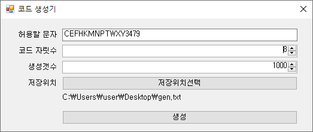

# 쿠폰(코드) 생성기

<br>



<br>

```bash
# 라인수 체크
wc -l {fileName}

# 중복라인 제거
awk '!x[$0]++ {print $0}' {fileName} > {outFileName}

# 라인수 체크
wc -l {outFileName}

# 파일 분리하기(라인수)
split -l 1000000 --additional-suffix=.txt {fileName} {outFileName}

```
